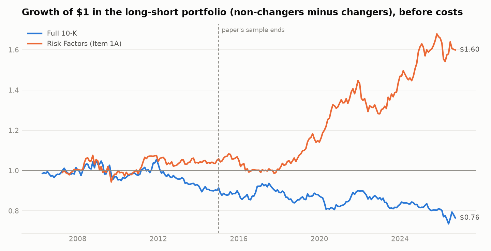

# Lazy Prices: do investors read what changed in a 10-K?

A replication and extension of Cohen, Malloy and Nguyen, "Lazy Prices" (Journal of
Finance, 2020), built end to end from raw SEC filings.

The paper's claim: companies that change the wording of their annual report the most
tend to underperform afterwards, because investors do not notice the edits. This
project rebuilds that signal for S&P 500 companies, tests whether it survives after
the paper's sample period, checks whether standard risk factors explain it, and adds
an embedding-based measure that separates rewording from new content.

**Live dashboard:** https://lazy-prices.streamlit.app

## What I found

Sample: 9,553 10-K filings from 495 current S&P 500 companies (filed 2005 to 2026),
9,035 year-over-year comparisons, monthly returns from March 2006 to September 2026.
Full tables are in [reports/RESULTS.md](reports/RESULTS.md).

| Pre-registered test | Long-short return | t-stat | Six-factor alpha | t-stat |
| --- | --- | --- | --- | --- |
| Full 10-K, cosine similarity | -10 bps / month | -1.19 | -6 bps / month | -0.81 |
| Risk Factors (Item 1A), cosine similarity | +21 bps / month | 2.08 | +15 bps / month | 1.74 |

**The headline effect does not replicate in large caps.** Sorting on changes to the
whole document earns nothing: the spread is slightly negative and insignificant.

**Risk Factors points the way the paper predicts, but the evidence is weak.**
Companies that changed their risk language least beat those that changed it most by 21
bps a month, with average returns rising across the quintiles (122, 123, 138, 142, 143
bps). The spread appears after 2015 (31 bps a month, t = 2.11) and is absent before
(7 bps, t = 0.59). After adjusting for six factors the alpha is 15 bps (p = 0.08), and
12 bps after trading costs (t = 1.31). With two pre-registered tests the bar is
p < 0.025, so this does not clear it. Jaccard and edit-distance versions of the same
section show no effect, and MD&A similarity has the opposite sign, so I do not read
the Risk Factors result as a reliable anomaly.

**The embedding extension is informative for a different reason.** Semantic similarity
of Risk Factors has no return spread at all (-1 bps, t = -0.07), even though it
correlates 0.73 with the cosine measure. Whatever weak signal exists sits in word-level
edits, not in passages that are new in meaning. As a tool, though, the embedding step
works well: it surfaces the specific passages with no close match in the prior year's
filing (for example, new tariff language in Apple's 2025 Risk Factors), which the
dashboard shows per company.



Why a weak result is expected here: the original effect is strongest in small,
thinly-followed stocks, the paper has been public for years, and this sample uses
annual filings only. See [docs/METHODOLOGY.md](docs/METHODOLOGY.md) for the full list
of limitations, including survivorship bias.


## Pipeline

```
SEC EDGAR ──> raw 10-Ks ──> clean text + Item 1A / Item 7 ──> year-over-year similarity
                                                                     │
Yahoo prices ──> monthly returns ──┐                                 ▼
Ken French factors ────────────────┴──> quintile portfolios ──> factor attribution ──> report + dashboard
```

| Stage | Module | What it does |
| --- | --- | --- |
| Ingest | `edgar.py` | Rate-limited, resumable download of every 10-K since 2005 via the SEC submissions API |
| Parse | `parse.py` | HTML to text, removes numeric tables and hidden XBRL, extracts Risk Factors and MD&A with quality gates |
| Signal | `similarity.py` | Cosine, Jaccard and edit-distance similarity between consecutive fiscal years |
| Extension | `semantic.py` | Passage-level sentence embeddings: semantic similarity, share of novel content, the passages that changed most |
| Backtest | `backtest.py` | Point-in-time quintile sorts, turnover and trading costs |
| Attribution | `attribution.py` | CAPM, FF3, FF5 and FF5 + momentum regressions with Newey-West errors |
| Report | `research.py`, `report.py` | Pre-registered specification, out-of-sample split, robustness tables, figures |
| Dashboard | `app/streamlit_app.py` | Results, factor loadings, per-company similarity history and changed passages |

## What makes the results trustworthy

- **No look-ahead.** A filing is tradable only from the first month-end at least one
  business day after it was filed, and earns the following month's return. A unit test
  plants a large same-month return and proves the backtest cannot capture it.
- **Pre-registered design.** Two primary signals and one specification were fixed
  before looking at returns. All other variations are reported as robustness.
- **Measured parser quality.** Extraction success rates by year are published in
  `reports/RESULTS.md`. Sections that fail the checks are excluded, not guessed.
- **Honest limits.** Survivorship bias from using current index members, large caps
  only, annual filings only, equal weights. Each is explained in
  [docs/METHODOLOGY.md](docs/METHODOLOGY.md).

## Run it

Requires [uv](https://docs.astral.sh/uv/). SEC EDGAR requires a contact User-Agent:
copy `.env.example` to `.env` and put your name and email in it.

```bash
uv sync --extra app                 # install
uv run lp ingest                    # filing index + download (~9,000 10-Ks, resumable)
uv run lp analyze                   # parse, similarity, prices, factors, backtest, report
uv run streamlit run app/streamlit_app.py

# optional embedding extension
uv sync --extra app --extra semantic
uv run lp semantic && uv run lp report

uv run pytest                       # unit tests
```

Raw filings and extracted text are not committed (several GB, re-creatable). The small
result tables in `data/processed` are committed so the dashboard runs without them.

## Reference

Cohen, L., Malloy, C., and Nguyen, Q. (2020). Lazy Prices. *Journal of Finance*, 75(3), 1371-1415.
