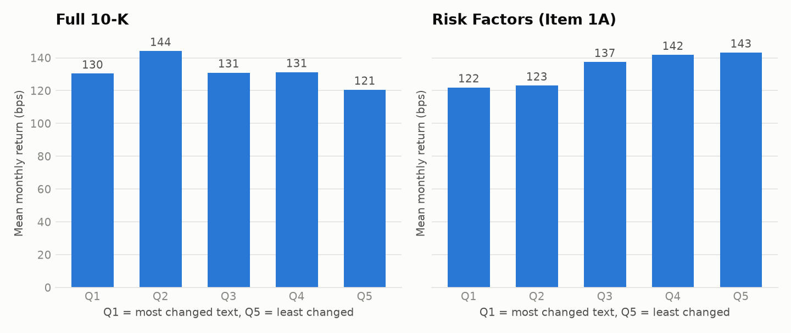
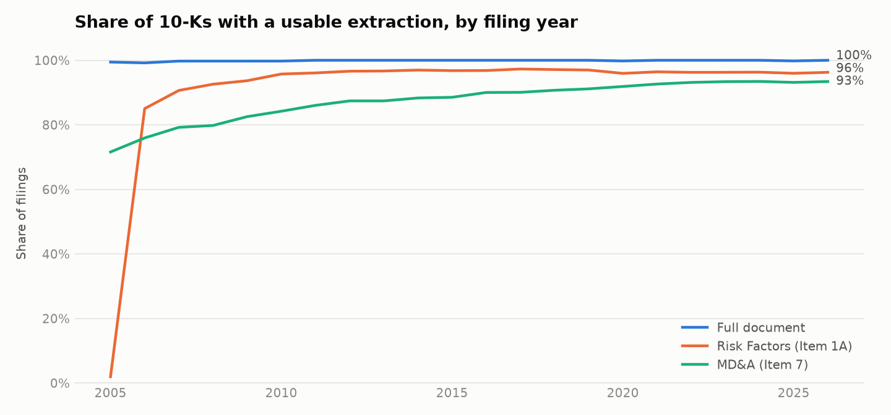
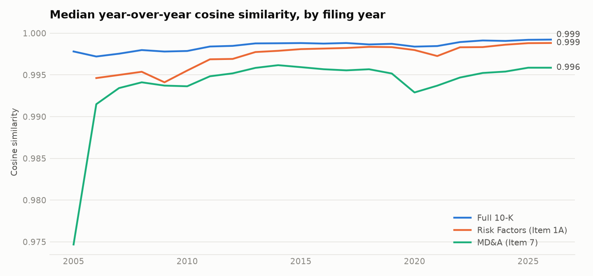

# Results

_Generated by `lp report`. Every number is read from data/processed; none is typed by hand._

## Data

| companies_in_universe | 10-K_filings_parsed | year_over_year_pairs | first_filing | last_filing | return_months |
| --- | --- | --- | --- | --- | --- |
| 498 | 9553 | 9035 | 2005-01-12 | 2026-09-29 | 2006-03-31 to 2026-09-30 |

## Primary specification

Quintile sort, equal-weighted, 12-month hold. LS = Q5 (least changed text) minus Q1 (most changed). t-statistics use Newey-West standard errors (6 lags). LS_net subtracts trading costs.

| signal | sample | series | months | mean_monthly_bps | ann_return | ann_vol | sharpe | t_stat | max_drawdown | hit_rate |
| --- | --- | --- | --- | --- | --- | --- | --- | --- | --- | --- |
| full_cosine | Full sample | LS | 247 | -9.8 | -1.18% | 5.03% | -0.23 | -1.19 | -30.3% | 47% |
| full_cosine | Full sample | LS_net | 247 | -13.6 | -1.63% | 5.04% | -0.32 | -1.65 | -35.5% | 46% |
| full_cosine | Through 2014 (inside the paper's sample) | LS | 106 | -7.5 | -0.89% | 5.18% | -0.17 | -0.69 | -15.2% | 48% |
| full_cosine | Through 2014 (inside the paper's sample) | LS_net | 106 | -11.5 | -1.38% | 5.17% | -0.27 | -1.06 | -17.2% | 48% |
| full_cosine | 2015 onward (out of sample) | LS | 141 | -11.6 | -1.39% | 4.93% | -0.28 | -0.96 | -21.5% | 46% |
| full_cosine | 2015 onward (out of sample) | LS_net | 141 | -15.2 | -1.82% | 4.95% | -0.37 | -1.25 | -24.6% | 45% |
| item1a_cosine | Full sample | LS | 235 | 21.2 | 2.55% | 5.46% | 0.47 | 2.08 | -12.3% | 60% |
| item1a_cosine | Full sample | LS_net | 235 | 17.5 | 2.10% | 5.47% | 0.38 | 1.70 | -12.8% | 60% |
| item1a_cosine | Through 2014 (inside the paper's sample) | LS | 94 | 7.2 | 0.86% | 5.33% | 0.16 | 0.58 | -12.3% | 59% |
| item1a_cosine | Through 2014 (inside the paper's sample) | LS_net | 94 | 3.2 | 0.38% | 5.33% | 0.07 | 0.26 | -12.8% | 57% |
| item1a_cosine | 2015 onward (out of sample) | LS | 141 | 30.6 | 3.67% | 5.54% | 0.66 | 2.11 | -11.4% | 62% |
| item1a_cosine | 2015 onward (out of sample) | LS_net | 141 | 27.0 | 3.24% | 5.56% | 0.58 | 1.85 | -11.8% | 61% |

## Factor attribution of the long-short return

Alpha is the monthly return left after the listed factors. A loading (beta) far from zero means the strategy is partly that factor in disguise.

| signal | sample | model | months | alpha_monthly_bps | alpha_t | alpha_p | r2 | beta_MKT_RF | beta_SMB | beta_HML | beta_RMW | beta_CMA | beta_MOM |
| --- | --- | --- | --- | --- | --- | --- | --- | --- | --- | --- | --- | --- | --- |
| full_cosine | Full sample | CAPM | 246 | -4.4 | -0.54 | 0.590 | 0.03 | -0.05 |  |  |  |  |  |
| full_cosine | Full sample | FF3 | 246 | -3.6 | -0.45 | 0.655 | 0.04 | -0.06 | 0.01 | 0.04 |  |  |  |
| full_cosine | Full sample | FF5 | 246 | -4.8 | -0.62 | 0.538 | 0.05 | -0.06 | 0.03 | 0.06 | 0.07 | -0.07 |  |
| full_cosine | Full sample | FF5+MOM | 246 | -6.4 | -0.81 | 0.419 | 0.07 | -0.05 | 0.04 | 0.09 | 0.08 | -0.10 | 0.06 |
| full_cosine | Through 2014 (inside the paper's sample) | CAPM | 106 | -3.1 | -0.33 | 0.742 | 0.04 | -0.07 |  |  |  |  |  |
| full_cosine | Through 2014 (inside the paper's sample) | FF3 | 106 | -5.9 | -0.59 | 0.557 | 0.09 | -0.02 | -0.10 | -0.10 |  |  |  |
| full_cosine | Through 2014 (inside the paper's sample) | FF5 | 106 | -13.5 | -1.23 | 0.217 | 0.12 | -0.00 | -0.09 | -0.14 | 0.09 | 0.17 |  |
| full_cosine | Through 2014 (inside the paper's sample) | FF5+MOM | 106 | -11.9 | -1.10 | 0.270 | 0.16 | 0.01 | -0.09 | -0.08 | 0.08 | 0.11 | 0.07 |
| full_cosine | 2015 onward (out of sample) | CAPM | 140 | -5.8 | -0.46 | 0.648 | 0.02 | -0.04 |  |  |  |  |  |
| full_cosine | 2015 onward (out of sample) | FF3 | 140 | -4.0 | -0.34 | 0.732 | 0.10 | -0.05 | 0.05 | 0.09 |  |  |  |
| full_cosine | 2015 onward (out of sample) | FF5 | 140 | -4.0 | -0.36 | 0.718 | 0.14 | -0.07 | 0.05 | 0.15 | 0.05 | -0.17 |  |
| full_cosine | 2015 onward (out of sample) | FF5+MOM | 140 | -4.6 | -0.41 | 0.682 | 0.14 | -0.07 | 0.05 | 0.15 | 0.06 | -0.17 | 0.01 |
| item1a_cosine | Full sample | CAPM | 234 | 16.2 | 1.58 | 0.113 | 0.03 | 0.06 |  |  |  |  |  |
| item1a_cosine | Full sample | FF3 | 234 | 14.4 | 1.57 | 0.117 | 0.22 | 0.06 | 0.11 | -0.22 |  |  |  |
| item1a_cosine | Full sample | FF5 | 234 | 17.2 | 1.88 | 0.060 | 0.25 | 0.04 | 0.09 | -0.16 | -0.03 | -0.16 |  |
| item1a_cosine | Full sample | FF5+MOM | 234 | 15.3 | 1.74 | 0.081 | 0.27 | 0.06 | 0.11 | -0.13 | -0.01 | -0.18 | 0.06 |
| item1a_cosine | Through 2014 (inside the paper's sample) | CAPM | 94 | 5.5 | 0.45 | 0.652 | 0.01 | 0.03 |  |  |  |  |  |
| item1a_cosine | Through 2014 (inside the paper's sample) | FF3 | 94 | -0.1 | -0.01 | 0.995 | 0.09 | 0.03 | 0.14 | -0.17 |  |  |  |
| item1a_cosine | Through 2014 (inside the paper's sample) | FF5 | 94 | -6.0 | -0.39 | 0.693 | 0.16 | 0.05 | 0.17 | -0.09 | 0.24 | -0.22 |  |
| item1a_cosine | Through 2014 (inside the paper's sample) | FF5+MOM | 94 | -5.0 | -0.38 | 0.703 | 0.19 | 0.06 | 0.17 | -0.04 | 0.24 | -0.27 | 0.05 |
| item1a_cosine | 2015 onward (out of sample) | CAPM | 140 | 22.4 | 1.47 | 0.140 | 0.06 | 0.08 |  |  |  |  |  |
| item1a_cosine | 2015 onward (out of sample) | FF3 | 140 | 25.3 | 2.14 | 0.032 | 0.32 | 0.06 | 0.10 | -0.24 |  |  |  |
| item1a_cosine | 2015 onward (out of sample) | FF5 | 140 | 26.8 | 2.31 | 0.021 | 0.36 | 0.05 | 0.06 | -0.17 | -0.09 | -0.13 |  |
| item1a_cosine | 2015 onward (out of sample) | FF5+MOM | 140 | 24.2 | 2.08 | 0.037 | 0.38 | 0.06 | 0.09 | -0.15 | -0.07 | -0.14 | 0.06 |

## Mean monthly return by quintile (bps)

| signal | sample | Q1 | Q2 | Q3 | Q4 | Q5 | avg_names | avg_monthly_turnover |
| --- | --- | --- | --- | --- | --- | --- | --- | --- |
| full_cosine | Full sample | 130 | 144 | 131 | 131 | 121 | 424 | 19.0% |
| full_cosine | Through 2014 (inside the paper's sample) | 122 | 130 | 131 | 146 | 115 | 380 | 20.3% |
| full_cosine | 2015 onward (out of sample) | 137 | 155 | 131 | 120 | 125 | 458 | 18.1% |
| full_jaccard | Full sample | 134 | 126 | 131 | 132 | 135 | 424 | 18.0% |
| full_jaccard | Through 2014 (inside the paper's sample) | 125 | 113 | 132 | 136 | 138 | 380 | 19.4% |
| full_jaccard | 2015 onward (out of sample) | 142 | 136 | 130 | 129 | 132 | 458 | 17.0% |
| full_edit | Full sample | 130 | 137 | 125 | 140 | 126 | 424 | 17.9% |
| full_edit | Through 2014 (inside the paper's sample) | 112 | 132 | 124 | 146 | 129 | 380 | 18.9% |
| full_edit | 2015 onward (out of sample) | 143 | 140 | 125 | 136 | 124 | 458 | 17.0% |
| item1a_cosine | Full sample | 122 | 123 | 137 | 142 | 143 | 408 | 18.9% |
| item1a_cosine | Through 2014 (inside the paper's sample) | 129 | 114 | 134 | 146 | 136 | 360 | 19.9% |
| item1a_cosine | 2015 onward (out of sample) | 117 | 129 | 140 | 139 | 148 | 441 | 18.2% |
| item1a_jaccard | Full sample | 126 | 139 | 129 | 140 | 134 | 408 | 18.9% |
| item1a_jaccard | Through 2014 (inside the paper's sample) | 135 | 134 | 112 | 145 | 132 | 360 | 19.9% |
| item1a_jaccard | 2015 onward (out of sample) | 120 | 143 | 140 | 136 | 135 | 441 | 18.2% |
| item1a_edit | Full sample | 137 | 134 | 134 | 131 | 132 | 408 | 19.6% |
| item1a_edit | Through 2014 (inside the paper's sample) | 134 | 141 | 113 | 140 | 131 | 360 | 20.1% |
| item1a_edit | 2015 onward (out of sample) | 138 | 129 | 149 | 125 | 133 | 441 | 19.2% |
| item7_cosine | Full sample | 147 | 143 | 139 | 133 | 119 | 370 | 18.5% |
| item7_cosine | Through 2014 (inside the paper's sample) | 141 | 157 | 137 | 132 | 117 | 309 | 20.6% |
| item7_cosine | 2015 onward (out of sample) | 152 | 133 | 141 | 134 | 121 | 416 | 17.0% |
| item7_jaccard | Full sample | 150 | 139 | 138 | 132 | 125 | 370 | 17.7% |
| item7_jaccard | Through 2014 (inside the paper's sample) | 145 | 137 | 136 | 138 | 128 | 309 | 19.7% |
| item7_jaccard | 2015 onward (out of sample) | 153 | 140 | 139 | 126 | 122 | 416 | 16.2% |
| item7_edit | Full sample | 130 | 144 | 133 | 144 | 131 | 370 | 17.3% |
| item7_edit | Through 2014 (inside the paper's sample) | 130 | 147 | 129 | 142 | 136 | 309 | 18.9% |
| item7_edit | 2015 onward (out of sample) | 131 | 141 | 136 | 146 | 127 | 416 | 16.2% |
| item1a_semantic | Full sample | 136 | 136 | 124 | 137 | 135 | 408 | 18.8% |
| item1a_semantic | Through 2014 (inside the paper's sample) | 152 | 119 | 109 | 141 | 138 | 360 | 20.0% |
| item1a_semantic | 2015 onward (out of sample) | 126 | 146 | 134 | 134 | 133 | 441 | 18.1% |
| item7_semantic | Full sample | 138 | 142 | 131 | 137 | 134 | 370 | 18.1% |
| item7_semantic | Through 2014 (inside the paper's sample) | 142 | 147 | 120 | 135 | 140 | 309 | 19.9% |
| item7_semantic | 2015 onward (out of sample) | 135 | 139 | 140 | 138 | 129 | 416 | 16.8% |

## Robustness: every signal, FF5+MOM alpha of the long-short return

| signal | sample | months | alpha_monthly_bps | alpha_t | alpha_p |
| --- | --- | --- | --- | --- | --- |
| full_cosine | Full sample | 246 | -6.4 | -0.81 | 0.419 |
| full_cosine | Through 2014 (inside the paper's sample) | 106 | -11.9 | -1.10 | 0.270 |
| full_cosine | 2015 onward (out of sample) | 140 | -4.6 | -0.41 | 0.682 |
| full_jaccard | Full sample | 246 | 0.3 | 0.03 | 0.979 |
| full_jaccard | Through 2014 (inside the paper's sample) | 106 | 14.6 | 0.90 | 0.370 |
| full_jaccard | 2015 onward (out of sample) | 140 | -12.0 | -0.93 | 0.353 |
| full_edit | Full sample | 246 | -0.4 | -0.04 | 0.971 |
| full_edit | Through 2014 (inside the paper's sample) | 106 | 19.9 | 1.12 | 0.261 |
| full_edit | 2015 onward (out of sample) | 140 | -19.6 | -1.64 | 0.101 |
| item1a_cosine | Full sample | 234 | 15.3 | 1.74 | 0.081 |
| item1a_cosine | Through 2014 (inside the paper's sample) | 94 | -5.0 | -0.38 | 0.703 |
| item1a_cosine | 2015 onward (out of sample) | 140 | 24.2 | 2.08 | 0.037 |
| item1a_jaccard | Full sample | 234 | 5.0 | 0.40 | 0.686 |
| item1a_jaccard | Through 2014 (inside the paper's sample) | 94 | -7.4 | -0.40 | 0.689 |
| item1a_jaccard | 2015 onward (out of sample) | 140 | 13.4 | 1.16 | 0.246 |
| item1a_edit | Full sample | 234 | -1.9 | -0.19 | 0.852 |
| item1a_edit | Through 2014 (inside the paper's sample) | 94 | -5.6 | -0.30 | 0.765 |
| item1a_edit | 2015 onward (out of sample) | 140 | -2.4 | -0.30 | 0.766 |
| item7_cosine | Full sample | 246 | -24.6 | -2.18 | 0.030 |
| item7_cosine | Through 2014 (inside the paper's sample) | 106 | -29.1 | -1.47 | 0.142 |
| item7_cosine | 2015 onward (out of sample) | 140 | -22.8 | -1.86 | 0.063 |
| item7_jaccard | Full sample | 246 | -24.5 | -1.97 | 0.049 |
| item7_jaccard | Through 2014 (inside the paper's sample) | 106 | -12.6 | -0.56 | 0.575 |
| item7_jaccard | 2015 onward (out of sample) | 140 | -27.9 | -2.13 | 0.033 |
| item7_edit | Full sample | 246 | -2.0 | -0.17 | 0.863 |
| item7_edit | Through 2014 (inside the paper's sample) | 106 | 8.8 | 0.42 | 0.672 |
| item7_edit | 2015 onward (out of sample) | 140 | -7.0 | -0.49 | 0.626 |
| item1a_semantic | Full sample | 234 | -1.7 | -0.16 | 0.875 |
| item1a_semantic | Through 2014 (inside the paper's sample) | 94 | -21.5 | -1.10 | 0.270 |
| item1a_semantic | 2015 onward (out of sample) | 140 | 8.4 | 0.82 | 0.414 |
| item7_semantic | Full sample | 246 | -5.8 | -0.52 | 0.603 |
| item7_semantic | Through 2014 (inside the paper's sample) | 106 | 6.8 | 0.32 | 0.749 |
| item7_semantic | 2015 onward (out of sample) | 140 | -8.6 | -0.70 | 0.487 |

## Robustness: holding period (primary signals, full sample)

| signal | hold_months | months | mean_monthly_bps | t_stat | alpha_monthly_bps | alpha_t | avg_names |
| --- | --- | --- | --- | --- | --- | --- | --- |
| full_cosine | 3 | 86 | -21.2 | -0.95 | -11.7 | -0.55 | 257 |
| full_cosine | 6 | 229 | -37.6 | -2.94 | -40.5 | -3.02 | 232 |
| full_cosine | 12 | 247 | -9.8 | -1.19 | -6.4 | -0.81 | 424 |
| item1a_cosine | 3 | 81 | 31.1 | 1.20 | 23.1 | 0.96 | 249 |
| item1a_cosine | 6 | 206 | 19.7 | 1.18 | 10.4 | 0.70 | 233 |
| item1a_cosine | 12 | 235 | 21.2 | 2.08 | 15.3 | 1.74 | 408 |

## Parser scorecard by filing year

| year | filings | parse_errors | full_ok | item1a_ok | item7_ok | median_words |
| --- | --- | --- | --- | --- | --- | --- |
| 2005.0 | 359.0 | 0.0 | 99.4% | 1.9% | 71.6% | 34,594 |
| 2006.0 | 374.0 | 0.0 | 99.2% | 85.0% | 75.9% | 36,882 |
| 2007.0 | 385.0 | 0.0 | 99.7% | 90.6% | 79.2% | 39,472 |
| 2008.0 | 391.0 | 0.0 | 99.7% | 92.6% | 79.8% | 41,941 |
| 2009.0 | 395.0 | 0.0 | 99.7% | 93.7% | 82.5% | 44,810 |
| 2010.0 | 399.0 | 0.0 | 99.7% | 95.7% | 84.2% | 46,548 |
| 2011.0 | 408.0 | 0.0 | 100.0% | 96.1% | 86.0% | 46,925 |
| 2012.0 | 413.0 | 0.0 | 100.0% | 96.6% | 87.4% | 46,819 |
| 2013.0 | 421.0 | 0.0 | 100.0% | 96.7% | 87.4% | 47,179 |
| 2014.0 | 428.0 | 0.0 | 100.0% | 97.0% | 88.3% | 48,329 |
| 2015.0 | 436.0 | 0.0 | 100.0% | 96.8% | 88.5% | 48,206 |
| 2016.0 | 441.0 | 0.0 | 100.0% | 96.8% | 90.0% | 48,682 |
| 2017.0 | 443.0 | 0.0 | 100.0% | 97.3% | 90.1% | 49,757 |
| 2018.0 | 452.0 | 0.0 | 100.0% | 97.1% | 90.7% | 50,740 |
| 2019.0 | 463.0 | 0.0 | 100.0% | 97.0% | 91.1% | 51,932 |
| 2020.0 | 468.0 | 0.0 | 99.8% | 95.9% | 91.9% | 52,402 |
| 2021.0 | 475.0 | 0.0 | 100.0% | 96.4% | 92.6% | 55,040 |
| 2022.0 | 481.0 | 0.0 | 100.0% | 96.3% | 93.1% | 54,246 |
| 2023.0 | 483.0 | 0.0 | 100.0% | 96.3% | 93.4% | 53,230 |
| 2024.0 | 488.0 | 0.0 | 100.0% | 96.3% | 93.4% | 53,606 |
| 2025.0 | 496.0 | 1.0 | 99.8% | 96.0% | 93.1% | 53,886 |
| 2026.0 | 455.0 | 0.0 | 100.0% | 96.3% | 93.4% | 54,756 |

## Figures

